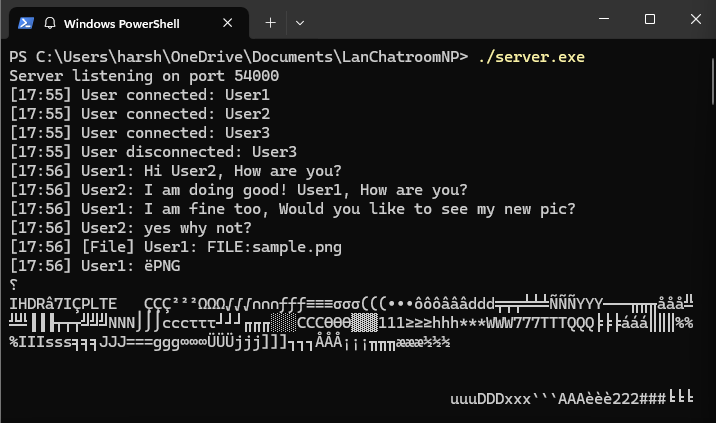
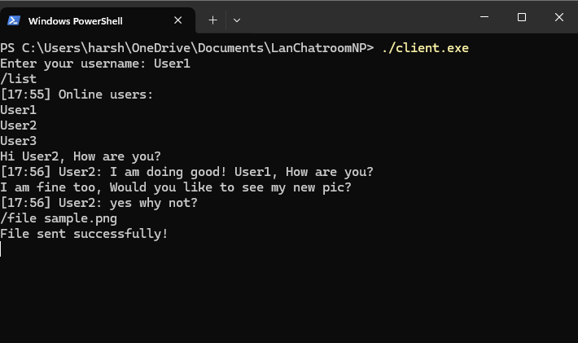
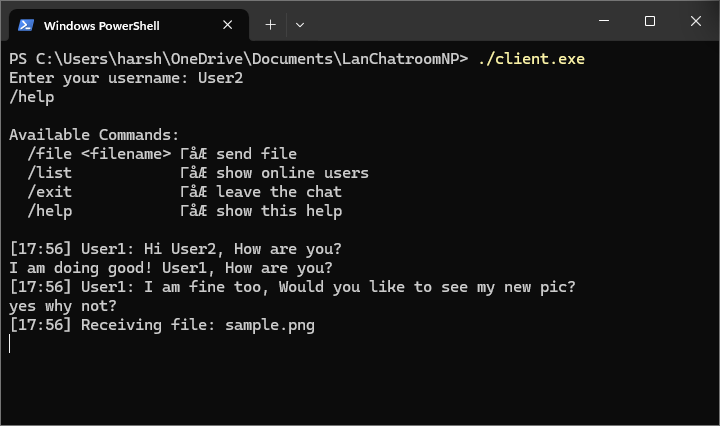
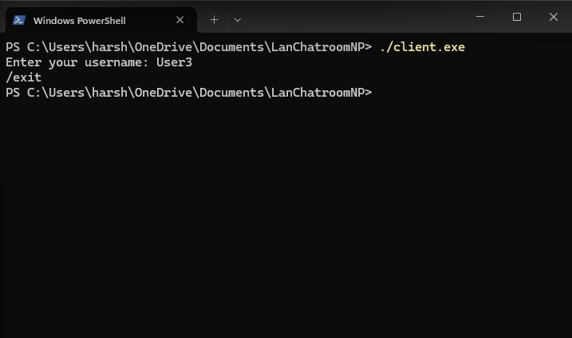

# 💬 LAN Chat Room with File Transfer

> Cross-platform (Windows & macOS) multi-client chat system with file transfer, built using C++ sockets.

---

## ✨ Features

- ✅ Real-time LAN chat for multiple users
- ✅ File transfer between clients
- ✅ Server sees all messages & file activity
- ✅ Colored, timestamped console messages
- ✅ Chat log saved to `chatlog.txt`
- ✅ Auto-save received files in `received/` folder
- ✅ `/help` command for ease of use
- ✅ Works on both Windows and macOS (cross-platform)

---

## 🏗 Architecture

```
+-----------+       +-------------+       +-----------+
|  Client A | <---> |   Server    | <---> |  Client B |
+-----------+       +-------------+       +-----------+
        \                                   /
         \--------- File Relay ------------/
```

- **Server**: Listens on a TCP socket, handles each client in a new thread
- **Client**: Connects to server, can send/receive messages and files

---

## ⚙ Technologies Used

| Component   | Tech            |
|-------------|-----------------|
| Language    | C++             |
| Sockets     | Winsock2 (Windows), BSD (macOS) |
| Compiler    | g++ / MinGW / clang++ |
| IDE         | VS Code / Code::Blocks |
| OS Support  | Windows 10/11, macOS Ventura+ |
| Threads     | std::thread     |
| Filesystem  | fstream, mkdir  |

---

## 🖥 Installation & Build

### Windows:
```bash
g++ server.cpp -o server.exe -lws2_32
g++ client.cpp -o client.exe -lws2_32
```

### macOS:
```bash
g++ server.cpp -o server -pthread -std=c++11
g++ client.cpp -o client -pthread -std=c++11
```

---

## ▶️ Usage

### Run the server:
```bash
./server   # or server.exe
```

### Run one or more clients:
```bash
./client   # or client.exe
```

Each client will:
- Prompt for username
- Join chat room
- Be able to send messages, send files, and use commands

---

## 💬 Commands

| Command            | Description                          |
|--------------------|--------------------------------------|
| `/file <filename>` | Sends a file to all other clients    |
| `/list`            | Lists all online users               |
| `/help`            | Shows available commands             |
| `/exit`            | Disconnects from the server          |

---

## 📂 File Transfer Details

- Client sends header: `FILE:<filename>
`
- File data is sent in binary chunks
- `FILE_END
` is sent after transfer completes
- Receiving clients:
  - Save file in `received/` folder
  - Display confirmation message

---

## 🛠 Enhancements Added

- 📁 `received/` auto-save folder creation
- 📝 All chat messages saved to `chatlog.txt`
- 💡 `/help` command for user-friendly CLI
- 🟩 "You:" message formatting for sender
- ⏱ Timestamp prefix: `[HH:MM]`
- 🟦 Server shows username when clients connect/disconnect

---

## 📸 Demo Screenshots

### ✅ Server showing connection logs


### ✅ Client chatting with timestamp


### ✅ Client chatting with timestamp


### ✅ Client chatting with timestamp



---

## 👥 Contributors

- 👨‍💻 Harsh Chaudhary Kalwar (`221715`)
- 👨‍💻 Pranil Poudel (`221734`)

🎓 Course: **Network Programming**  
📚 College: **Nepal College of Information Technology**  
👨‍🏫 Instructor: **Mr. Madan Kadariya**

---

## ✅ Status

- Final version tested and verified on both Windows and macOS 
- All requirements met and enhancements added
- Demo screenshots provided for clarity
- Contributors listed and acknowledged
---

## 📝 License
This project is licensed under the MIT License - see the `LICENSE` file for details.
---
## 📚 Acknowledgement
This project was created as a part of the Network Programming course at Nepal College of Information Technology. We would like to thank our instructor, Mr. Madan Kadariya, for his guidance and support throughout the course. We would also like to thank our peers for their collaboration and feedback.
---
## 📚 Contact
If you have any questions or need further clarification, please don't hesitate to contact us at `harshchy143@gmail.com`
---
## 📚 Version
This is the final version of the project. We have tested and verified it on both Windows and macOS platforms.
---

## 📚 Reference
- [1] https://www.geeksforgeeks.org/socket-programming-cc/
- [2] https://www.tutorialspoint.com/cprogramming/c_networking.htm
- [3] https://www.geeksforgeeks.org/socket-programming-in-cc-for-client-server-model/

---

